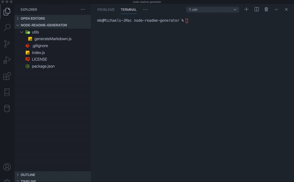

# oiehjfoishf

hsefhslfhj

## Description

khslfhslf

## Demo

   
[Video Link](https://drive.google.com/file/d/1mu1BhJ9Ivs2hHOi6RxQoTLWZfFdT3Zk6/view?usp=sharing)

## Table of Contents
- [oiehjfoishf](#oiehjfoishf)
  - [Description](#description)
  - [Demo](#demo)
  - [Table of Contents](#table-of-contents)
  - [Installation](#installation)
  - [Usage](#usage)
  - [License](#license)
  - [Contributors](#contributors)
  - [Test](#test)
  - [Repository Link](#repository-link)
  - [GitHub](#github)

## Installation

Open your repository in an integrated terminal. Run this command:

        ksahflsihef

## Usage

The application will be invoked with the following command:

        khsagkuahskf

## License 

MIT

## Contributors

ksjhfkshefs

## Test

undefined

## Repository Link

- [Project Repository](lwknefwef)

## GitHub

 
-[Email me](mailto:michael@kelly.media)
 

